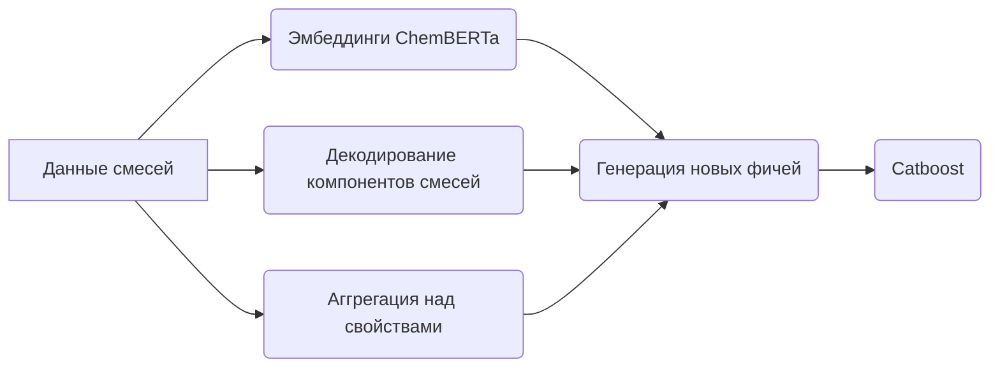

# Нефтекод: NEUROTECH-SPBPU-MISIS

Решение команды NEUROTECH-SPBPU-MISIS

## Структура репозитория

- `/docs` - Папка с презентацией
- `/data` - Папка с входными данными соревнования
- `/notebooks` - Папка с ноутбуками финального решения
- `/graph-notebooks` - Папка с ноутбуками решения через графовые нейросети

## Папка notebooks

В папке лежат ноутбуки, которые нужно запускать по очереди, для того, чтобы получить финальное решение
Финальное решение будет лежать в папке `notebooks/preds`

*Зависимости необходимые для запуска кода, находятся в файле `requirements.txt`

## Папка /docs

Внутри папки лежит презентация в pdf формате
Презентация содержит в себе подробное описание нашего ML решения

## Наше решение
