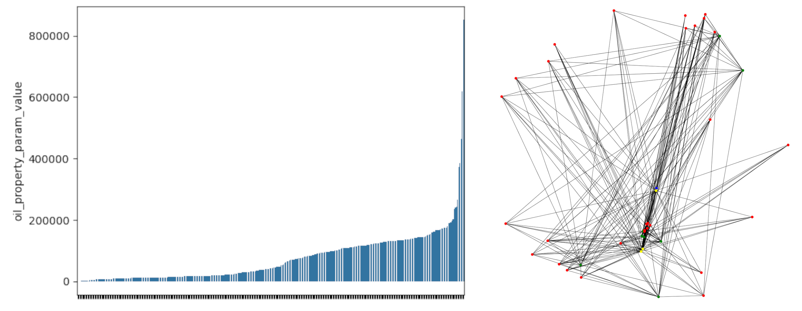

# 
<h2>Препроцессинг</h2>

График слева демонстрирует распределение oil_property_param_value.

Справа граф, который отражает структуру данных для одного масла.
  
🔴 Красный - component_property_param_title

  
🟢 Красный - component

  
🟡 Красный - oil_property_param_title

  
🔵 Синий - blend_id

  ...

<h2>Решение</h2>

  ...

<h2>Заключение</h2>

  ...

