# Нефтекод: NEUROTECH SPBPU-MISIS 🥉

Решение команды NEUROTECH-SPBPU-MISIS

## Структура репозитория

- `/docs` - Папка с презентацией
- `/data` - Папка с входными данными соревнования
- `/notebooks` - Папка с ноутбуками финального решения
- `/graph-notebooks` - Папка с ноутбуками решения через графовые нейросети
- `/other-netebooks` - Папка с разными подходами, которые мы пробовали

## Папка notebooks

В папке лежит ноутбук, который нужно запустить для того, чтобы получить финальное решение
Финальное решение и сабмит будут лежать в папке `notebooks/preds`
Веса для модели находятся в папке `notebooks/catboost_weights`

*Зависимости необходимые для запуска кода, находятся в файле `requirements.txt`

## Папка /docs

Внутри папки лежит презентация в pdf формате
Презентация содержит в себе подробное описание нашего ML решения

## Наше решение

```mermaid
graph LR
A[Данные смесей] --> B(Декодирование компонентов смесей)
A --> C(Эмбеддинги ChemBERTa)
A --> E(Аггрегация над свойствами)
C --> D(Генерация новых фичей)
B --> D
E --> D
D --> T(Catboost)
```

